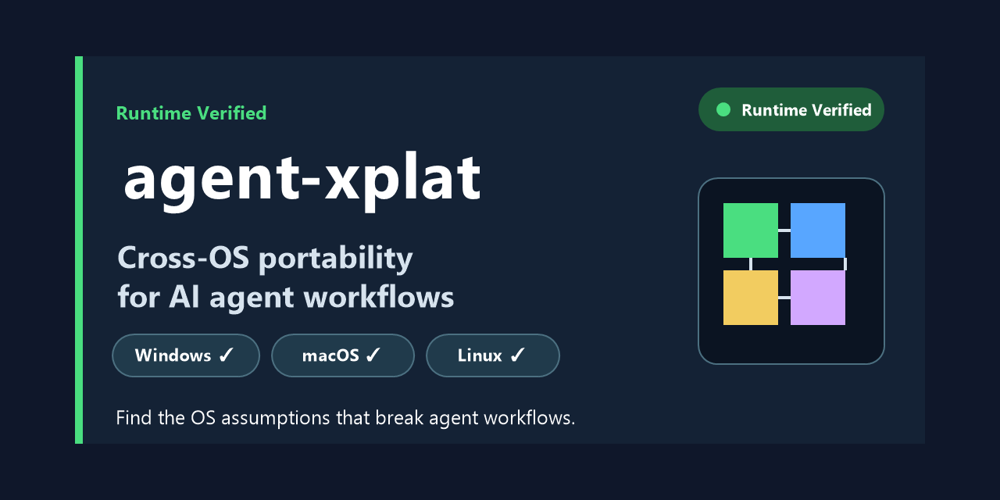

# agent-xplat

> 找出那些會破壞 AI Agent 工作流程的作業系統假設。

[English](README.md) · [简体中文](README.zh-CN.md) · [繁體中文](README.zh-TW.md)

[](https://pypi.org/project/agent-xplat/)
[](https://pypi.org/project/agent-xplat/)
[](https://github.com/kwhi6693-web/agent-xplat/actions/workflows/agent-xplat.yml)
[](https://github.com/kwhi6693-web/agent-xplat/actions/workflows/agent-xplat.yml)
[](LICENSE)



## 為什麼是 agent-xplat

AI Agent 工作流程通常會組合 Markdown 指令、Shell 命令、Python、Node、套件管理器與外部工具。一個在 Linux Bash 中有效的工作流程，仍可能在 Windows PowerShell、Windows CMD、Git Bash、WSL 或 macOS zsh 中失敗。

`agent-xplat` 是一個確定性的跨作業系統可攜性檢查器，用來檢查 AI Agent 工作流程、Agent Skills、Agent 設定與相關腳本。它回報造成失敗的 **OS × Shell × Runtime** 假設，而不只是指出作業系統不同。

Skill validator 檢查結構，通用 linter 檢查風格；`agent-xplat` 檢查這些表面上有效的工作流程，能否在 Agent 實際執行的環境中正常運作。它明確不是安全掃描器、Agent Skill schema validator、benchmark、通用 linter 或專案健康檢查工具。

目前的驗證路徑會在真實的 GitHub-hosted Windows、macOS 與 Linux runner 上執行。靜態分析涵蓋完整的 8 個 target 矩陣；靜態發現使用 `STATIC = INFERRED`，只有真實 runner 或受控的本機執行階段檢查才會產生 `RUNTIME = VERIFIED` 證據。

## 快速開始

從 PyPI 安裝已發布的 package，並掃描目前專案：

```bash
python -m pip install agent-xplat
agent-xplat scan .
```

如果需要隔離的 CLI 安裝：

```bash
pipx install agent-xplat
agent-xplat scan .
```

掃描會產生確定性的、依 target 區分的相容性矩陣：

```text
Agent Workflow Portability
===========================

Compatibility Matrix
---------------------
Environment                Score Status    Findings
Windows / PowerShell      41/100 BLOCKED          4
Windows / CMD              1/100 BLOCKED          6
Windows / Git Bash        76/100 PARTIAL          3
Windows / WSL             76/100 PARTIAL          3
macOS / zsh               56/100 PARTIAL          4
macOS / bash              56/100 PARTIAL          4
Linux / bash              56/100 PARTIAL          4
Linux / zsh               56/100 PARTIAL          4

7 portability issues found (0 ignored)
```

這些 score 是確定且可解釋的。以上是專案內建的 mixed-platform fixture 範例，不代表每個專案都會得到相同結果。

## 📦 安裝

需要 Python 3.10 或更新版本。package 已以 wheel 與 source distribution 形式發布到 PyPI。在 active virtual environment 中使用 `python -m pip install agent-xplat`，或使用 `pipx install agent-xplat` 進行隔離的 CLI 安裝。執行階段 package 包含 JavaScript/JSX/TypeScript/TSX AST 分析所需的輕量 Tree-sitter parser bindings；`pytest` 僅屬於 development extra。從原始碼 checkout 工作時，`pipx install .` 仍是方便的隔離 CLI 安裝方式。

從原始碼 checkout 安裝：

```bash
python -m pip install .
agent-xplat scan .
```

開發環境：

```bash
python -m pip install -e ".[dev]"
python -m pytest -q
```

也可以隨時使用 module invocation 作為 fallback：

```bash
python -m agent_xplat scan . --format json
```

## 🔍 支援的環境

內部模型是 OS × Shell × Runtime：

| Target | OS | Shell | Runtime context |
|---|---|---|---|
| `windows-powershell` | Windows | PowerShell | native |
| `windows-cmd` | Windows | CMD | native |
| `windows-git-bash` | Windows | Bash | Git Bash |
| `windows-wsl` | Windows | Bash | WSL |
| `macos-zsh` | macOS | zsh | native |
| `macos-bash` | macOS | Bash | native |
| `linux-bash` | Linux | Bash | native |
| `linux-zsh` | Linux | zsh | native |

## 📋 掃描內容

預設的受限探索流程包括 `SKILL.md`、`AGENTS.md`、`CLAUDE.md`、`GEMINI.md`、`README.md`、`.github/**`、`.cursor/**`、`.claude/**`、`.codex/**`、`scripts/**`、package manifest/lockfile、Python metadata、Docker/Make 檔案，以及常見的 Shell、Python、JavaScript、JSX、TypeScript、TSX 與 batch 副檔名（`.js`、`.mjs`、`.cjs`、`.jsx`、`.ts`、`.mts`、`.cts`、`.tsx`）。`.git`、`node_modules`、`vendor`、`dist`、`build`、快取、二進位檔與超大檔案會被排除。

## ✨ 範例

內建 fixture 涵蓋 portable、OS-specific、shell-specific、Python、Node、mixed 與 agent-instruction 工作流程：

```bash
agent-xplat scan tests/fixtures/mixed
agent-xplat scan tests/fixtures/python --format json
agent-xplat scan tests/fixtures/node --format sarif --output agent-xplat.sarif
agent-xplat scan tests/fixtures/node-ast --format json
```

`tests/fixtures/*/expected.json` 中的 fixture metadata 會記錄預期規則、受影響 target、severity 與 confidence。這些是測試資料，不是對第三方工具標準的宣告。

## 🧩 規則、嚴重程度與信心

目前 registry 包含 49 條模組化規則，並使用穩定的 `AX-*` identifier。規則涵蓋路徑、Shell 命令與環境變數語法、quoting、Python、Node package script 與 Node/JS/TS AST 事實、檔案系統、套件管理器、外部工具、執行階段假設及 Agent 設定。JavaScript 系列原始碼會使用 Tree-sitter 進行結構化解析；動態字串與動態行為仍屬於靜態推斷。詳見 [docs/RULES.md](docs/RULES.md)。

Severity 為 `BLOCKER`、`ERROR`、`WARNING` 或 `INFO` 之一。Confidence 為 `HIGH`、`MEDIUM` 或 `LOW` 之一。低信心假設會明確標示為低信心，不會僅僅因為不方便就升級為 blocker。

## 📊 掃描與報告

```bash
agent-xplat scan .
agent-xplat scan . --format json --output agent-xplat.json
agent-xplat scan . --format sarif --output agent-xplat.sarif
agent-xplat report .
```

JSON 使用 `schema_version: 1.0` 進行版本化，供 Agent 與 CI 使用，並包含 `targets`、`scores`、`findings`、`baseline`、`contract`、`verification` 與 `summary`。SARIF 輸出為 2.1.0，包含 file、line、column、rule、level、message 與 help。Markdown 報告包含 executive summary、矩陣、blocking issues、warnings、assumptions、contract violations、受影響檔案、建議修復、證據、ignored findings 與 baseline 狀態。

## 🛠️ 安全修復

```bash
agent-xplat fix . --dry-run
agent-xplat fix .
```

只有確定性、高信心且維持行為的修復才有資格自動套用。v1.0.1 會自動將 CRLF shebang 檔案正規化為 LF。Shell 重寫、路徑重寫、環境變數語法轉換與依賴遷移仍只作為建議，因為僅憑靜態文字無法證明它們等價。Dry-run 會列印 unified patch，不會修改檔案。

## 🧪 執行階段驗證

```bash
agent-xplat test .
```

`scan` 不會執行 target code。`test` 是顯式且受限的：它可以在 timeout 限制下執行 allowlist 中的專案測試命令，並記錄實際 host target、命令、exit code 與輸出尾端。缺少命令時狀態為 `INFERRED`，而不是 `VERIFIED`。單一主機的執行階段證據不能證明整個矩陣。

## ⚙️ GitHub Actions 與 SARIF

```bash
agent-xplat init-ci
```

產生的 workflow 會在 `windows-latest`、`macos-latest` 與 `ubuntu-latest` 上執行，安裝專案、執行測試、進行靜態掃描、呼叫受控執行階段驗證、產生 JSON/SARIF/Markdown artifact，並將 SARIF 上傳到 Code Scanning。僅僅在本機存在 workflow 檔案，並不能證明 hosted jobs 已通過；在宣稱跨作業系統驗證之前，專案必須實際執行這些 jobs。

## 🧭 基準與差異模式

```bash
agent-xplat baseline
agent-xplat scan . --baseline-only
agent-xplat scan . --diff master
agent-xplat scan . --diff HEAD~1 --format markdown
```

Baseline 會區分 existing、new 與 resolved fingerprint。`--baseline-only` 會針對新增發現執行 gate。Diff mode 會從 Git reference 比較前後 score 與 issue fingerprint，不會執行 reference tree。

## 📐 相容性契約

`.agent-xplat.yml` 接受宣告式支援範圍與 requirements：

```yaml
supported:
  - windows-powershell
  - windows-git-bash
  - windows-wsl
  - macos-zsh
  - linux-bash
unsupported:
  - windows-cmd
requirements:
  python: ">=3.11"
  node: ">=22"
minimum_score: 85
fail_on:
  - BLOCKER
  - ERROR
```

也接受可選的 `agent-xplat:` wrapper。宣告的 support 會與偵測到的假設比較，並以 `VIOLATION` 回報；unsupported target 不會被視為契約失敗。

## 🧾 設定與忽略規則

```bash
agent-xplat init
```

Schema 支援 `targets`、`exclude`、`ignore`、`minimum_score`、`fail_on`、`supported`、`unsupported`、`requirements`、`max_file_size` 與 `verification`。全域 suppression 使用 `ignore`。行級 marker 是明確且可稽核的：

```text
# agent-xplat-ignore AX-SHELL-001
chmod +x scripts/render.sh
```

Ignored findings 仍會以 `ignored: true` 保留在 machine-readable output 中，summary 也會回報其數量。未知 key、target、severity、rule ID 與無效值都會以 exit code 2 失敗。未使用的行級 suppression marker 會作為 suppression diagnostic 回報，而不會被靜默接受。

## 🤖 Agent-native 使用與 exit code

```bash
agent-xplat scan . --format json
```

Agent 應使用 `summary`、每個 target 的 `scores`、`findings` 與 `contract.violations`，不要解析 terminal decoration。CLI 命令包括 `scan`、`test`、`fix`、`report`、`explain`、`doctor`、`baseline`、`init`、`init-ci` 與 `badge`；root command 也支援 `--version`。

| Code | 含義 |
|---:|---|
| 0 | 沒有觸發已設定的可攜性 gate |
| 1 | 可攜性違規、契約違規或新的 diff regression |
| 2 | 設定、輸入、Git reference 或命令參數無效 |
| 3 | 工具內部發生未預期錯誤 |

## 🩺 Badge 與 doctor

```bash
agent-xplat badge
agent-xplat doctor
```

預設 badge 文案為 `Static Checked` 與 `Inference only`。`Cross-OS Verified` badge 必須有記錄 Windows、macOS 與 Linux 驗證證據的 verification artifact 支撐；靜態掃描不會自動產生該 badge。`doctor` 只回報本機是否有 Git、Node、Python、Docker、PowerShell、Git Bash、WSL、Bash 與 zsh，不檢查專案健康狀態。

## 🛡️ 安全模型

預設命令離線執行、相對於 target source 只讀、不執行 target code、不收集 telemetry，也不會上傳資料。`test` 是唯一可能執行選定 allowlist 專案測試命令的命令，並且不允許 shell operator，具有受限 timeout 與清楚的執行階段證據記錄。不存在 AI API、SaaS backend、credential upload 或隱藏網路路徑。

## 🏗️ 架構

詳見 [docs/ARCHITECTURE.md](docs/ARCHITECTURE.md)。核心流程為：

```text
Config -> bounded discovery -> structured/text parsers -> rule registry
      -> target-specific findings -> suppression -> score/contract
      -> terminal / JSON / SARIF / Markdown / baseline / diff
```

## ⚠️ 限制與路線圖

靜態分析無法證明每一種 Shell 版本、已安裝工具、檔案系統策略、原生 binary、動態命令字串或執行階段行為。JavaScript 系列原始碼已涵蓋支援副檔名的結構化 AST 分析，但動態求值、產生程式碼、不支援的語法恢復與實際 subprocess 行為仍屬執行階段問題。Release workflow 已產生並有文件說明，但 hosted runner 證據必須來自使用者自己的 GitHub 專案。未來可以增加更多 runtime adapter 與經過獨立審查的規則，同時保持公開 finding contract 不變。

## 📦 發布與驗證

目前版本為 **v1.0.1**。package 已以 wheel 與 source distribution 形式發布到 [PyPI](https://pypi.org/project/agent-xplat/)，GitHub [Release v1.0.1](https://github.com/kwhi6693-web/agent-xplat/releases/tag/v1.0.1) 是對應的發布記錄。

發布路徑使用 GitHub Actions Trusted Publishing，也就是基於 OIDC 的發布流程，不需要長期有效的 PyPI token。[驗證記錄](docs/audit/verification-run.md) 說明本機檢查、託管 Windows/macOS/Linux 證據、package readback，以及 inferred 靜態發現與 verified 執行階段結果之間的邊界。發布變更彙整在 [CHANGELOG.md](CHANGELOG.md)。

## 🤝 貢獻

請閱讀 [CONTRIBUTING.md](CONTRIBUTING.md)，每次規則變更都加入 positive 與 negative fixture，執行 `python -m pytest -q`，並維持輸出的確定性。不要加入 telemetry、網路呼叫、secret 或機器特定路徑。

## 📄 授權條款

MIT。詳見 [LICENSE](LICENSE)。
